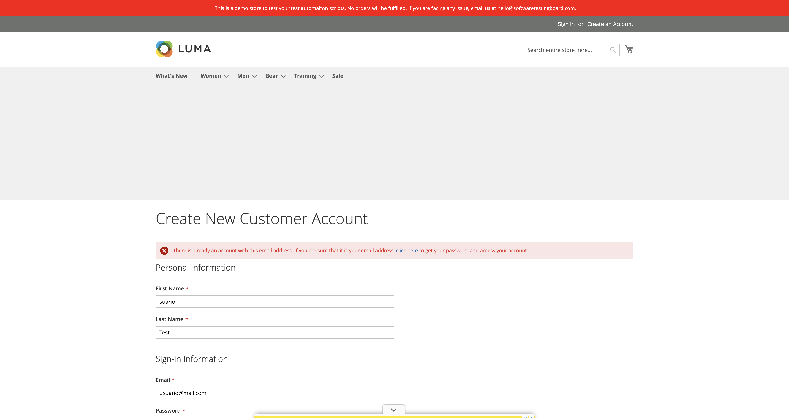
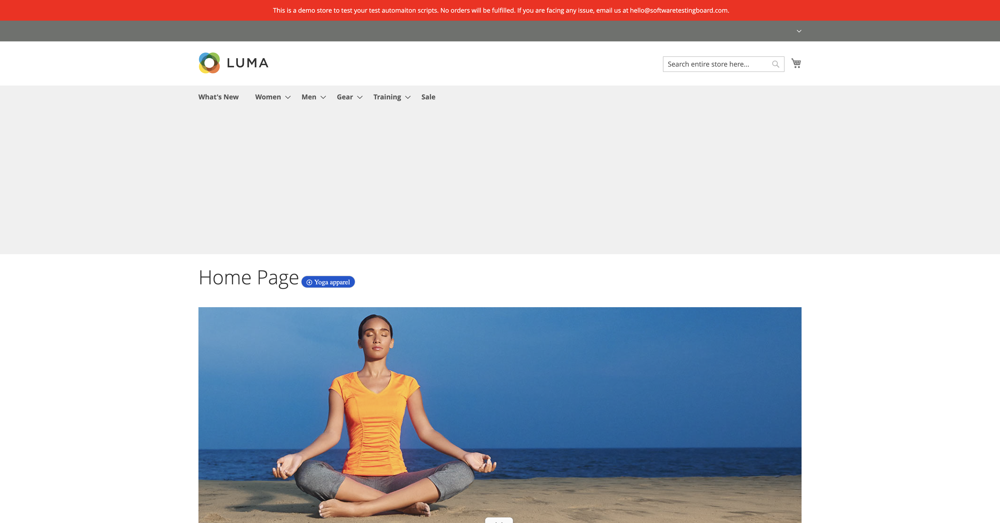
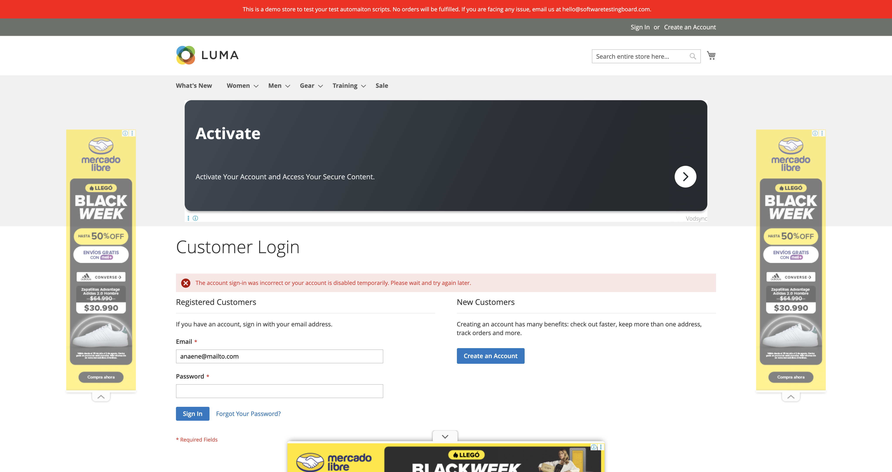
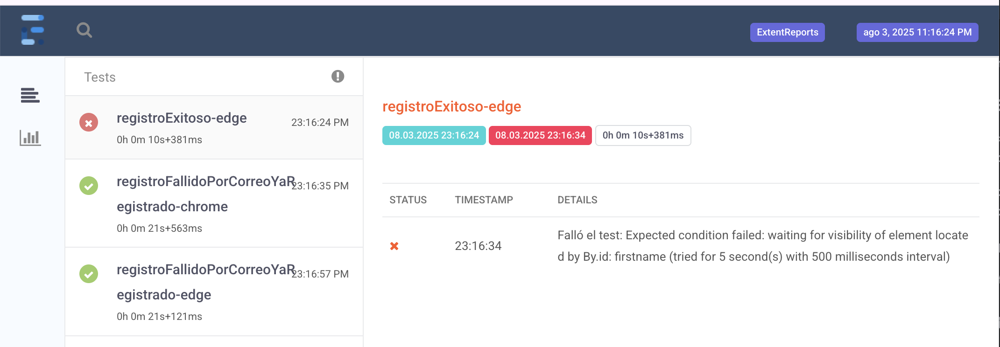

# 🧪 SUITE_AUTOMATIZACION_SELENIUM

## 📘 Descripción del Proyecto

Este proyecto consiste en una suite de automatización funcional desarrollada en **Java 8** utilizando **Selenium WebDriver**, **TestNG**, **ExtentReports**, **Apache POI** y el patrón **Page Object Model (POM)**. El objetivo es validar formularios de **registro** e **inicio de sesión** en el sitio de pruebas https://magento.softwaretestingboard.com/.

### 🎯 Objetivo del Proyecto

El propósito de esta suite de automatización es demostrar la implementación de pruebas funcionales automatizadas en un entorno realista, utilizando herramientas y buenas prácticas ampliamente adoptadas en la industria. Este tipo de pruebas son fundamentales para garantizar la calidad del software, reducir errores humanos, acelerar ciclos de desarrollo y facilitar la validación continua en proyectos reales.

### 🏗️ Arquitectura del Proyecto

La estructura del proyecto está organizada de forma modular siguiendo el patrón POM:

```bash
src/ 
├── main/ 
│ └── java/ 
│   └── pages/ 
│     ├── LoginPage.java 
│     └── RegistroPage.java
├── test/ 
│ └── java/
│   ├── dataproviders/
│   │ └── DatosTestProvider.java
│   ├── tests/
│   │ ├── BaseTest.java
│   │ ├── LoginTest.java 
│   │ ├── RegistroTest.java
│   │ └── TestFactory.java
│   ├── utils/   
│   │ ├── CapturaUtils.java
│   │ ├── ExcelUtils.java
│   │ └── ReporteManager.java  
└── resources/ 
    └── datosLogin.xlsx
```

### ⚙️ Instrucciones para Ejecutar los Tests

### Requisitos

- Java 8
- Maven
- Navegador Chrome o Edge

#### Instalación

1. Clona el repositorio:
   ```bash
   git clone https://github.com/tianitol/SUITE_SELENIUM_MOD4.git
   cd SUITE_SELENIUM_MOD4

2. Ejecuta los test con Maven
   ```bash
   mvn clean test

⚠️ Si no usas WebDriverManager, asegúrate de tener los drivers configurados localmente.

### 📸 Evidencias de Ejecución
Las capturas de pantalla se generan automáticamente y se almacenan en la carpeta target/ con nombres como:

- captura_loginExitoso-chrome_pass.png
- captura_registroFallido-edge_pass.png

Ejemplo de incrustación:

target/captura_loginExitoso-chrome_pass.png

### 📄 Reporte Final
Se genera un reporte HTML en target/ReporteCompleto.html con:

- Escenarios ejecutados
- Resultados (paso/fallo)
- Tiempos de ejecución

## 🧠 Lecciones Aprendidas

Durante el desarrollo de este proyecto se consolidaron conocimientos clave que aportan gran valor en procesos de reclutamiento y oportunidades laborales en QA y desarrollo de software:

- **Diseño modular con Page Object Model (POM):** Se estructuró el proyecto en clases reutilizables que encapsulan la lógica de interacción con las páginas de registro e inicio de sesión, facilitando el mantenimiento y escalabilidad del código.

- **Gestión de datos de prueba con Apache POI:** Se implementó carga masiva de datos desde un archivo Excel (`datosLogin.xlsx`) mediante `DataProvider`, permitiendo ejecutar múltiples escenarios de login con distintas combinaciones de credenciales.

- **Ejecución en múltiples navegadores:** Gracias al uso de `TestFactory` y `WebDriverManager`, se logró ejecutar los tests en paralelo en Chrome y Edge, validando la compatibilidad cross-browser de los flujos automatizados.

- **Generación de evidencias automáticas:** Se integró `ExtentReports` junto con `CapturaUtils` para generar reportes HTML con capturas de pantalla por cada test ejecutado, lo que facilita el análisis de resultados y la trazabilidad de errores.

- **Validación de flujos críticos:** Se automatizaron los siguientes escenarios:
   - Registro exitoso
   - Registro fallido por correo ya registrado
   - Login exitoso
   - Login fallido por credenciales inválidas
   - Login fallido por campos requeridos vacíos

## 🖼️ Evidencias Visuales de la Ejecución

A continuación se presentan capturas de pantalla generadas automáticamente por la clase `CapturaUtils` durante la ejecución de los tests. Estas evidencias se almacenan en la carpeta `target/` y se vinculan al reporte HTML generado por `ExtentReports`.

### ✅ Registro Exitoso


---

### ❌ Registro Fallido (Correo ya registrado)



---

### 🔐 Login Exitoso



---

### 🚫 Login Fallido (Credenciales inválidas)



---
### 🚫 Login Fallido (Campos requeridos)


---

### 📄 Reporte HTML



